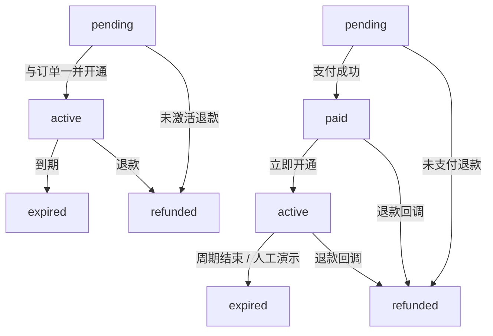

# 订单与订阅状态迁移

## Mermaid

## 说明

- **订单**（`orders.status`）与**订阅**（`subscriptions.status`）并行维护；支付成功后订单从 `pending` 经 `paid` 进入 `active`，与订阅从 `pending` 进入 `active` 在同一事务中完成（`services._fulfill_order_after_payment`）。
- **非法迁移**由 `app/state_machine.py` 的 `transition_order` / `transition_subscription` 校验，失败抛出 `StateMachineError`，服务层回滚事务，不向客户端静默写错状态。
- **`expired`**：演示环境通过 `POST /api/orders/{id}/expire` 或将 `current_period_end` 置于过去并由 `GET /api/orders/{id}` 触发的到期检测推进。
- **幂等**：`payment_events` 上 `(channel, provider_event_id)` 唯一；重复 Webhook 命中重复键后返回成功但不再次扣减 `plans.stock_remaining`。
